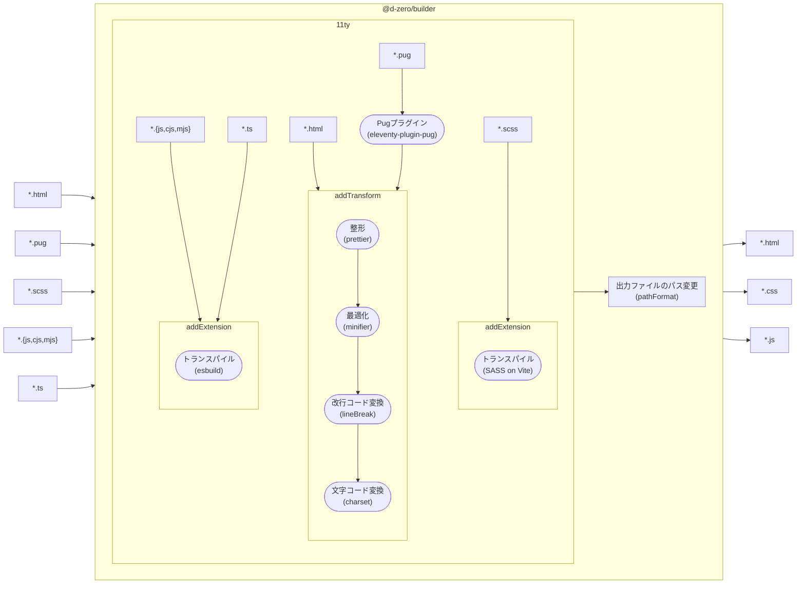

# ディーゼロ フロントエンド標準開発環境ビルドツール

[フロントエンド標準開発環境（`@d-zero/scaffold`）](https://github.com/d-zero-dev/frontend-env/blob/main/packages/%40d-zero/scaffold/)のビルド処理をパッケージしたものです。
Scaffoldに含めている`package.json`の`devDependencies`に記載してあるため、追加のインストールは基本的に不要です。

<details>
<summary>他の環境へのインストール</summary>

他の環境にインストールする場合は次のように追加します。

```sh
yarn add @d-zero/builder
```

</details>

## 使用方法

以下のコマンドを実行することでビルド処理が実行されます。

```sh
npx @d-zero/builder
```

## 利用技術

- [Eleventy](https://www.11ty.dev/): HTMLトランスパイルおよび全体のビルド処理
- [esbuild](https://esbuild.github.io/): JavaScriptトランスパイル
- [Vite](https://vitejs.dev/): CSSトランスパイル

## 設定

ベースがEleventyとなるので、Eleventyの設定ファイルを利用することができます。Scaffoldでは`eleventy.config.mjs`を用意しています。

```js
import path from 'node:path';

import eleventy from '@d-zero/builder/11ty';

export default function (eleventyConfig) {
	return eleventy(eleventyConfig, {
		alias: {
			'@': path.resolve(import.meta.dirname, '__assets', '_libs'),
		},
		outputCssDir: 'css',
		outputJsDir: 'js',
		outputImgDir: 'img',
		prettier: false,
		minifier: { minifyJS: false },
		lineBreak: '\r\n',
		charset: 'shift_jis',
		pathFormat: 'directory',
		autoDecode: true,
		ssi: { '**/*': { encoding: 'shift_jis' } },
	});
}
```

基本的なビルド設定は`@d-zero/builder/11ty`に規定されているため、それに追加の設定を行うことでビルド処理をカスタマイズすることができます。

### フローチャート



### カスタマイズ設定

`addGlobalData`メソッドを利用することで、ビルド処理に必要な設定を上書きします。

| オプションID   | 説明                                                 |
| -------------- | ---------------------------------------------------- |
| `alias`        | パスのエイリアスを設定します。                       |
| `outputCssDir` | CSSの出力ディレクトリを設定します。                  |
| `outputJsDir`  | JSの出力ディレクトリを設定します。                   |
| `outputImgDir` | 画像の出力ディレクトリを設定します。                 |
| `prettier`     | Prettierを有効にします。                             |
| `minifier`     | Minifierを有効にします。                             |
| `lineBreak`    | 改行コードを設定します。                             |
| `charset`      | 文字コードを設定します。                             |
| `pathFormat`   | パスのフォーマットを設定します。                     |
| `autoDecode`   | 開発用ローカルサーバーの自動デコードを有効にします。 |
| `ssi`          | 開発用ローカルサーバーのSSIの設定を行います。        |

詳細は[コーディングガイドライン](https://guidelines.d-zero.co.jp/html.html#builder)を確認してください。

その他、`eleventyConfig`インスタンスのプロパティやメソッドを用いてEleventyの設定を追加することで、ビルド処理をカスタマイズすることができます。

ViteやRollupに関する設定、その他ディレクトリ構成の変更などは`@d-zero/builder/11ty`で行うのは現状難しいため、Eleventyの設定ファイルで一から設定することになります。または、[Issue](https://github.com/d-zero-dev/frontend-env/issues)もしくは[プルリクエスト](https://github.com/d-zero-dev/frontend-env/pulls)変更可能なオプションをリクエストしてください。

## ロードマップ

静的サイトもしくはCMSのテンプレートを素早く構築するため、利用技術についてこだわりがあるわけではありません。そのため、利用技術の変更や追加を行うことがあります。現状、Eleventy/esbuild/Viteを利用している理由はちょうどよかっただけです。

### 技術採用のポイント

- HTML/CSS/JSの切り離しが容易であること
- HTMLに余計な要素・属性・コードが挿入されないこと
- ビルド処理が高速であること

### 予定

- Eleventy以外の選択肢の検討
